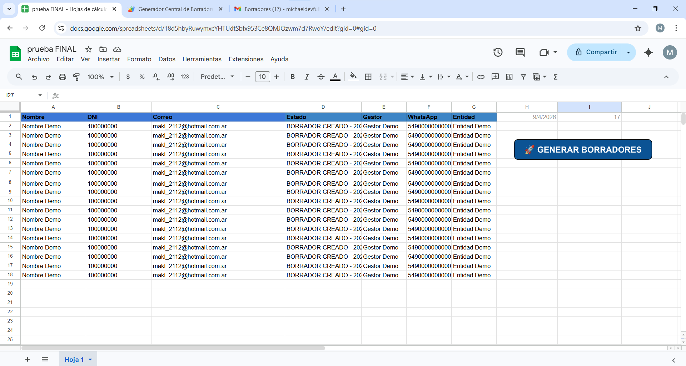
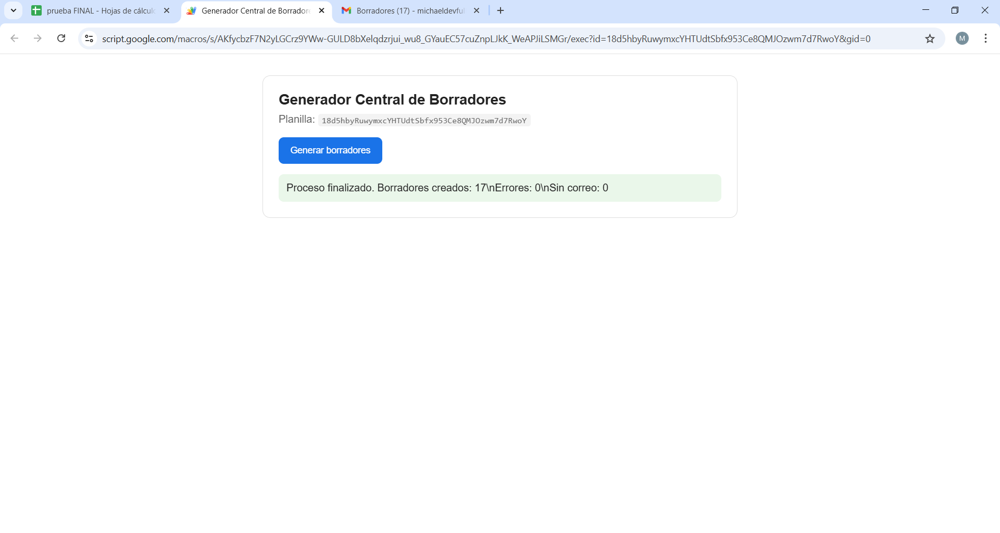
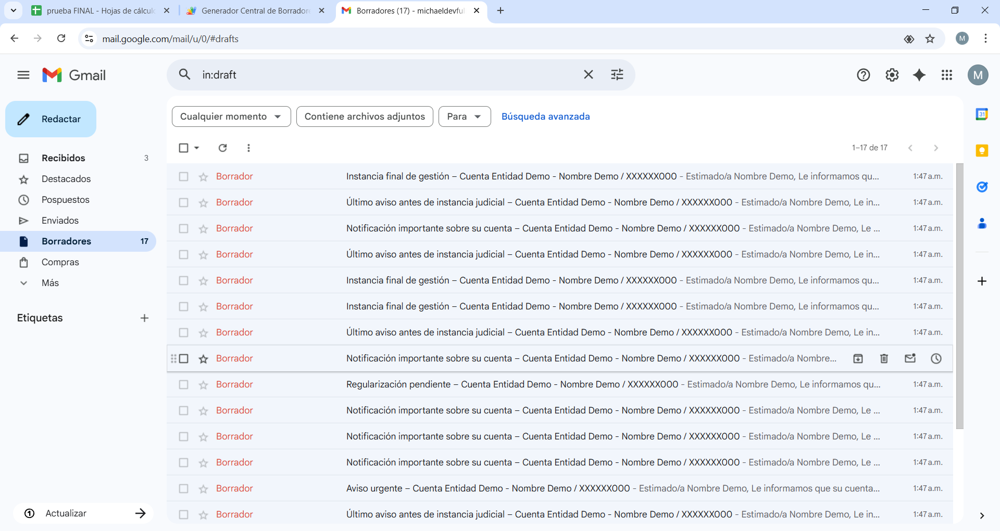

# 🚀 CobraSmart
## Generador de Borradores con Google Apps Script

Sistema de automatización desarrollado por **Michael Farias** para generar borradores de Gmail a partir de datos en Google Sheets, optimizando procesos de gestión y contacto.

---

## 📌 Descripción

**CobraSmart** es una solución diseñada para transformar procesos manuales en flujos automatizados utilizando herramientas del ecosistema Google.

Fue desarrollado e implementado en un entorno laboral real, permitiendo mejorar la eficiencia operativa sin necesidad de infraestructura adicional.

---

## 🎯 Problema

El proceso original presentaba:

- tareas manuales repetitivas  
- errores en la redacción de mensajes  
- falta de control de estados  
- baja eficiencia operativa  
- riesgo de clasificación como spam  

---

## 💡 Solución

Se desarrolló una **Web App centralizada** que permite:

- procesar datos automáticamente desde Google Sheets  
- identificar registros pendientes  
- generar borradores personalizados en Gmail  
- actualizar estados en la planilla  
- ser utilizada por usuarios no técnicos  

---

## ⚙️ Funcionalidades principales

- 📧 Generación automática de borradores  
- 📊 Integración con Google Sheets  
- 🔄 Sistema de estados (`PENDIENTE`, `BORRADOR CREADO`, `ERROR`)  
- 🧠 Plantillas dinámicas  
- 🔐 Control de licencias  
- 🚫 Límite de ejecución  
- ⚡ Control de concurrencia  
- 🌐 Interfaz Web App  

---

## 🧠 Decisiones técnicas

- ocultamiento parcial de datos sensibles (DNI)  
- variación de asuntos para mejorar entregabilidad  
- validación de datos antes de procesar  
- arquitectura reutilizable  
- interfaz simple para usuarios no técnicos  

---

## 📈 Resultados

- mejora en la entregabilidad de correos  
- reducción del tiempo operativo  
- aumento de eficiencia  
- mejor control del proceso  

---

## 🧾 Impacto real

Este sistema fue **desarrollado, implementado y utilizado en un entorno laboral real**.

Representa mi primera solución aplicada en producción, con impacto directo en la automatización de tareas y mejora de procesos operativos.

---

## 🛠️ Tecnologías utilizadas

- Google Apps Script (JavaScript)  
- Google Sheets (SpreadsheetApp)  
- Gmail (GmailApp)  
- HtmlService  
- PropertiesService  
- LockService  

---

## 🗂️ Estructura del proyecto

    cobra-smart-automation/
    ├── src/
    │   └── Code.js
    ├── ui/
    │   └── Run.html
    ├── examples/
    │   └── button-script.gs
    ├── docs/
    │   └── screenshots/
    │       ├── planilla.png
    │       ├── webapp.png
    │       └── gmail.png
    └── README.md

---

## 🖥️ Capturas del sistema

### 📊 Google Sheets

### 🚀 Web App

### 📬 Gmail

---

## 🔄 Flujo de funcionamiento

1. El usuario abre la planilla  
2. Ejecuta el botón  
3. Se abre la Web App  
4. Se valida la licencia  
5. Se procesan los registros  
6. Se generan los borradores  
7. Se actualizan los estados  

---

## 📚 Aprendizajes

- resolución de problemas reales  
- automatización de procesos  
- integración de servicios  
- validación de datos  
- diseño de soluciones para usuarios  

---

## ⚠️ Nota

Este repositorio contiene una versión adaptada para portfolio.  
Los datos sensibles fueron reemplazados.

---

## 👨‍💻 Autor

**Michael Farias**

---

